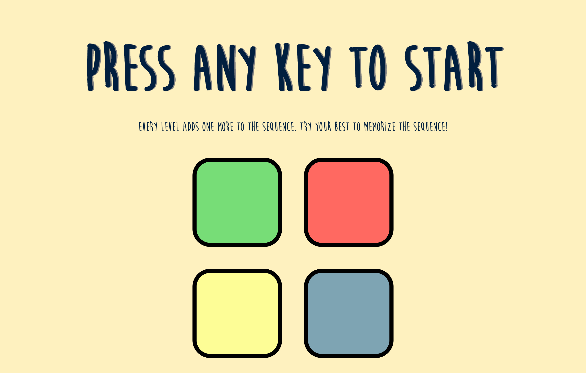

# Echo Echo Game

The Echo Echo game is a version of the Simon game. As you level up, another color is added to the sequence. You must memorize the pattern of the colors from each level to continue advancing.

[LIVE DEMO](https://matthewkcheng.github.io/echo-echo)

## Installation

After downloading the code, simply open the "index.html" file and the game should open up in your browser.

## How To Play

To start, press any key on your keyboard.

From there, as you progress through the levels, you must input the sequence from all past levels. Once you forget and make a mistake, it's game over.

## Tech Stack
* HTML5
* CSS3
* JavaScript
* jQuery

## Contributing
Pull requests are welcome. For major changes, please open an issue first to discuss what you would like to change.

Please make sure to update tests as appropriate.